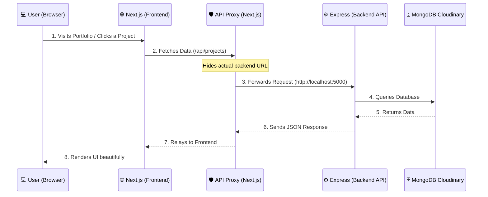

# 🚀 Next-Gen Full-Stack Developer Portfolio

Welcome to the ultimate Full-Stack Developer Portfolio repository. This project is a production-ready, highly secure, and visually interactive personal website paired with a powerful headless CMS (Content Management System) built from scratch.

This README is designed to help both **general users** (to understand what this is) and **developers** (to understand how it works under the hood).

---

## 🌟 What is this?

This is not just a static portfolio. It is a complete full-stack web application split into two main parts:
1. **The Frontend (`portfolio-frontend`)**: A modern, blazing-fast user interface built with **Next.js**. It features interactive elements (like a Hacker Mode, magnetic buttons, and custom cursors) and a fully hidden admin panel.
2. **The Backend (`portfolio-api`)**: A robust, secure **Node.js/Express** server that handles all the data (blogs, projects, diary entries, messages) and connects to a **MongoDB** database. 

---

## 🏗️ System Architecture & Internal Workflow

This application uses a modern **decoupled architecture**. The frontend and backend run as separate entities but communicate securely.

To protect the server from being exposed to the public internet, the Next.js frontend acts as a **Reverse Proxy**. 

### **The Workflow Diagram**
Here is a visual representation of how data flows through the app:



---

## 📂 Project Structure Explained

The root workspace contains two isolated projects:

```text
📦 Full Stack Workspace
 ┣ 📂 portfolio-frontend/      👉 The Next.js UI Application
 ┃  ┣ 📂 src/
 ┃  ┃  ┣ 📂 app/               👉 Next.js App Router (Pages: /blogs, /projects, /admin)
 ┃  ┃  ┗ 📂 components/        👉 Reusable UI pieces (Navbar, Admin Managers, HackerMode)
 ┃  ┣ 📜 next.config.mjs       👉 Core config (Handles our Reverse Proxy routing)
 ┃  ┗ 📜 .env                  👉 Frontend environment variables (.gitignore'd)
 ┃
 ┗ 📂 portfolio-api/           👉 The Node.js/Express Backend Server
    ┣ 📂 config/               👉 Database & Cloudinary configurations
    ┣ 📂 controllers/          👉 The "Brains" (Business logic for Blogs, Security, etc.)
    ┣ 📂 middleware/           👉 Interceptors (Auth checks, Honeypot trap)
    ┣ 📂 models/               👉 Database Blueprints (Admin, Blog, Project schemas)
    ┣ 📂 routes/               👉 API URL endpoints definition
    ┗ 📜 server.js             👉 The main entry point that boots up the backend
```

---

## 🛡️ Core Features & Innovations

### 1. **Built-in Admin Dashboard (CMS)**
Instead of using WordPress or Contentful, this portfolio has its own custom CMS available at `/admin`. Once logged in (via securely signed JWT tokens), you can Create, Read, Update, and Delete (CRUD) your:
- Blogs & Diary entries
- Portfolio Projects
- Skills & Education history
- Inbox / Contact Messages
- Global App Settings

### 2. **Advanced Security (The Honeypot 🍯)**
The backend comes equipped with a custom `honeypot.js` middleware. 
* **How it works:** Malicious bots constantly scan the web looking for vulnerabilities like `/wp-admin` or `.env`. If a bot hits one of these fake endpoints, our Honeypot flags their IP, blocks them, and records the attempt in our `SecurityLog` database.

### 3. **Reverse Proxy & Obfuscation**
Users never see the real backend URL (`http://localhost:5000` or the production equivalent). The Next.js `next.config.mjs` intercepts calls to `/api` and secretly forwards them to the backend server. The public only sees the Next.js domain.

### 4. **Immersive UI Elements**
- **Hacker Mode:** A fun, interactive toggle component (`HackerMode.js`) that transforms the portfolio theme.
- **Custom Cursor & Magnetic Buttons:** Smooth, modern web interactions that make the portfolio feel premium.

---

## 🚀 How to Run the Project Locally

To run this application on your local machine, follow these simple steps.

### Prerequisites
- **Node.js**: Installed on your machine (v18+ recommended).
- **MongoDB**: A local or cloud MongoDB database string.
- **Cloudinary**: An account for hosting images.

### Step 1: Clone & Install
Open two terminal windows (one for frontend, one for backend).

**Terminal 1 (Backend):**
```bash
cd portfolio-api
npm install
```

**Terminal 2 (Frontend):**
```bash
cd portfolio-frontend
npm install
```

### Step 2: Set Environment Variables
Create `.env` files in both directories.

**In `portfolio-api/.env`:**
```env
PORT=5000
MONGO_URI=your_mongodb_connection_string
JWT_SECRET=your_super_secret_key
CLOUDINARY_CLOUD_NAME=your_cloud_name
CLOUDINARY_API_KEY=your_api_key
CLOUDINARY_API_SECRET=your_api_secret
```

**In `portfolio-frontend/.env`:**
```env
# The URL where your backend is actually running
INTERNAL_BACKEND_URL=http://localhost:5000

# The base path the frontend uses (triggers the proxy)
NEXT_PUBLIC_API_URL=/api
```

### Step 3: Run the Servers

**Start the Backend:**
```bash
cd portfolio-api
node server.js
# Looks for "Secure Server locked and loaded on port 5000"
```

**Start the Frontend:**
```bash
cd portfolio-frontend
npm run dev
# App will strictly run on http://localhost:3000
```

🎉 Open your browser to `http://localhost:3000` and enjoy!

---

## 📖 API Endpoints Quick Reference
*(All these points are prefixed with `/api` via the proxy)*

- `POST /auth/login` - Authenticate admin & receive JWT.
- `GET /projects` - Fetch all portfolio projects.
- `POST /messages` - Allow a guest to leave a contact message.
- `GET /blogs` - Retrieve blog articles.
- `GET /security/logs` - **(Admin only)** View captured malicious bot logs.

---
*Built with ❤️ to showcase Full-Stack Architecture, Security, and Design styling.*