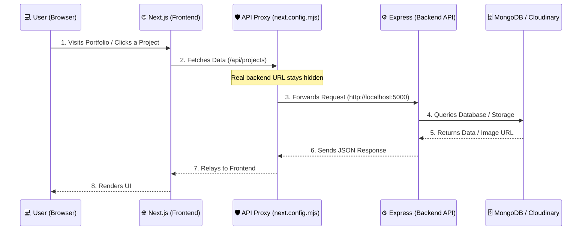

# 🚀 Next-Gen Full-Stack Developer Portfolio

<p align="center">
  
  
  
  
  <!-- 
  
  
</p> -->

> A production-ready, full-stack personal portfolio and headless CMS — built entirely from scratch. No WordPress. No templates. Just pure code.

---

## 🌟 What is this?

This is not just a static portfolio. It is a **complete full-stack web application** split into two main parts:

| Part | Tech | Description |
|------|------|-------------|
| **`portfolio-frontend`** | Next.js 16 + React 19 | A blazing-fast UI with an interactive hacker-mode terminal, custom cursor, magnetic buttons, and a hidden admin panel |
| **`portfolio-api`** | Node.js + Express | A secure REST API server with JWT auth, MongoDB storage, Cloudinary image hosting, and layered security middleware |

---

## 🏗️ System Architecture & Internal Workflow

This application uses a modern **decoupled architecture**. The frontend and backend run as separate entities but communicate securely.

To protect the server from being exposed to the public internet, the Next.js frontend acts as a **Reverse Proxy** via `next.config.mjs`. All `/api/*` traffic is silently forwarded to the Express backend — the real server URL is never visible to the browser.

### **Data Flow Diagram**



---

## 📂 Project Structure

```text
📦 portfolio-2.0/
 ┣ 📂 portfolio-frontend/           👉 Next.js UI Application
 ┃  ┣ 📂 src/
 ┃  ┃  ┣ 📂 app/                    👉 Next.js App Router pages
 ┃  ┃  ┃  ┣ 📄 page.js              👉 Home — hero, skills matrix, education timeline
 ┃  ┃  ┃  ┣ 📄 layout.js            👉 Root layout (CustomCursor, HackerMode, Footer)
 ┃  ┃  ┃  ┣ 📂 projects/            👉 /projects — filterable project showcase
 ┃  ┃  ┃  ┣ 📂 blogs/               👉 /blogs — article listing
 ┃  ┃  ┃  ┃  ┗ 📂 [slug]/           👉 /blogs/:slug — individual blog post
 ┃  ┃  ┃  ┣ 📂 contact/             👉 /contact — guest message form
 ┃  ┃  ┃  ┣ 📂 diary/               👉 /diary — private diary entries
 ┃  ┃  ┃  ┗ 📂 admin/               👉 /admin — login gate
 ┃  ┃  ┃     ┗ 📂 dashboard/        👉 /admin/dashboard — full CMS
 ┃  ┃  ┗ 📂 components/
 ┃  ┃     ┣ 📄 navbar.js            👉 Top navigation bar
 ┃  ┃     ┣ 📄 Footer.js            👉 Site footer
 ┃  ┃     ┣ 📄 HackerMode.js        👉 Ctrl+\ terminal overlay
 ┃  ┃     ┣ 📄 CustomCursor.js      👉 Custom animated cursor
 ┃  ┃     ┣ 📄 MagneticButton.js    👉 Magnetic hover-effect button
 ┃  ┃     ┗ 📂 admin/               👉 CMS panel components
 ┃  ┃        ┣ 📄 BlogManager.js
 ┃  ┃        ┣ 📄 DiaryManager.js
 ┃  ┃        ┣ 📄 EducationManager.js
 ┃  ┃        ┣ 📄 MessageManager.js
 ┃  ┃        ┣ 📄 ProjectManager.js
 ┃  ┃        ┣ 📄 SecurityManager.js
 ┃  ┃        ┣ 📄 SettingsManager.js
 ┃  ┃        ┗ 📄 SkillManager.js
 ┃  ┣ 📜 next.config.mjs            👉 Reverse proxy rewrite rules
 ┃  ┗ 📜 .env                       👉 Frontend env variables (gitignored)
 ┃
 ┗ 📂 portfolio-api/                👉 Node.js / Express Backend
    ┣ 📂 config/                    👉 DB (Mongoose) & Cloudinary setup
    ┣ 📂 controllers/               👉 Business logic per resource
    ┣ 📂 middleware/
    ┃  ┣ 📄 authMiddleware.js        👉 JWT verification guard
    ┃  ┗ 📄 honeypot.js             👉 Bot trap & IP logger
    ┣ 📂 models/                    👉 Mongoose schemas
    ┃  ┣ 📄 Admin.js
    ┃  ┣ 📄 Blog.js
    ┃  ┣ 📄 Diary.js
    ┃  ┣ 📄 Education.js
    ┃  ┣ 📄 Message.js
    ┃  ┣ 📄 Project.js
    ┃  ┣ 📄 SecurityLog.js
    ┃  ┣ 📄 Setting.js
    ┃  ┗ 📄 Skill.js
    ┣ 📂 routes/                    👉 Express route definitions
    ┣ 📄 seedAdmin.js               👉 One-time admin account seeder
    ┗ 📄 server.js                  👉 App entry point & security middleware stack
```

---

## 🛡️ Core Features & Innovations

### 1. Built-in Admin CMS Dashboard

Accessible at `/admin` — protected behind JWT authentication. Once logged in, you get full **CRUD** control over every piece of content via dedicated manager panels:

| Manager | What you can control |
|---------|----------------------|
| **ProjectManager** | Add / edit / delete portfolio projects with images, tech stack tags, GitHub & live links |
| **BlogManager** | Write Markdown blogs with AI-generated 3-point summaries, tags, and read-time |
| **DiaryManager** | Create private diary entries (visibility-toggled) |
| **EducationManager** | Manage education timeline entries |
| **SkillManager** | Add skills with proficiency percentages |
| **MessageManager** | Read contact messages sent by visitors |
| **SecurityManager** | View the honeypot security log — trapped IPs & attempted endpoints |
| **SettingsManager** | Edit hero text, primary accent color, social links, resume URL, and hiring status |

### 2. Advanced Security — The Honeypot 🍯

A custom `honeypot.js` middleware silently guards the server from automated scanners:

- **Trap routes monitored:** `/wp-admin`, `/.env`, `/admin.php`, `/config.json`, `/db-backup.zip`
- **On hit:** The attacker's IP, the attempted endpoint, and any request payload are saved to the `SecurityLog` collection in MongoDB, and a `403` response is returned.
- Logs are viewable in real time from the **SecurityManager** panel inside the admin dashboard.

### 3. Layered Security Middleware Stack

The Express server (`server.js`) applies **10 security layers** before any route handler runs:

| # | Middleware | Protection |
|---|-----------|------------|
| 1 | `helmet` | Secure HTTP headers (XSS, clickjacking, MIME sniffing, etc.) |
| 2 | `cors` | Strict allow-list — only your frontend origins can call the API |
| 3 | `express.json({ limit: '10kb' })` | Payload size cap — prevents oversized body attacks |
| 4 | `express-mongo-sanitize` | Strips `$` operators — blocks NoSQL injection |
| 5 | `xss-clean` | Sanitises HTML in input — blocks Cross-Site Scripting |
| 6 | `hpp` | Strips duplicate query params — blocks HTTP Parameter Pollution |
| 7 | Global rate limiter | 20 requests / 15 min per IP across all `/api/` routes |
| 8 | Contact rate limiter | 5 messages / hour per IP on `/api/messages` |
| 9 | Auth rate limiter | 10 login attempts / 15 min per IP on `/api/auth` |
| 10 | Custom Honeypot | Traps & logs bots scanning for known vulnerability paths |

### 4. Reverse Proxy & URL Obfuscation

`next.config.mjs` rewrites every `/api/*` request to the Express server at `INTERNAL_BACKEND_URL`. The real backend address is never exposed to the browser.

### 5. Immersive UI — Hacker Mode Terminal

Press **`Ctrl + \`** anywhere on the site to open a full Linux-style terminal overlay (`HackerMode.js`). Supported commands:

```
help            Show available commands
ls              List virtual directories (projects/, skills/, education/)
cat <dir>       Fetch live data from the API and print it
sudo login      Redirect to the /admin login portal
game / hack     Launch an in-terminal cybersecurity mini-game
clear           Clear terminal output
exit            Close the terminal
```

### 6. Additional UI Highlights

- **Custom Cursor** (`CustomCursor.js`) — replaces the default browser cursor with a styled animated dot.
- **Magnetic Buttons** (`MagneticButton.js`) — interactive Framer Motion buttons that follow the cursor on hover.
- **Skills Matrix** — live-fetched proficiency bars rendered on the home page.
- **Education Timeline** — chronological timeline built from the `Education` collection.
- **Blog Posts** — Markdown-rendered articles with slug-based routing (`/blogs/:slug`), tags, read time, and AI-generated TL;DR summaries.
- **Project Cards** — filterable by tech stack with search, grayscale-to-color image reveal on hover, and links to GitHub / live demo.

---

## 🧰 Tech Stack

### Frontend
| Technology | Version | Role |
|-----------|---------|------|
| Next.js | 16.2.1 | Framework — App Router, SSR, API rewrites |
| React | 19.2.4 | UI library |
| Tailwind CSS | v4 | Utility-first styling |
| Framer Motion | v12 | Animations & magnetic button interactions |

### Backend
| Technology | Version | Role |
|-----------|---------|------|
| Node.js | v18+ | Runtime environment |
| Express | ^4.22 | REST API framework |
| Mongoose | ^9.3 | MongoDB ODM |
| bcrypt | ^6.0 | Password hashing |
| jsonwebtoken | ^9.0 | JWT authentication |
| Cloudinary | ^1.41 | Image upload & hosting |
| Multer + multer-storage-cloudinary | ^2.1 | Multipart file handling |
| Helmet | ^8.1 | Secure HTTP headers |
| express-rate-limit | ^8.3 | API rate limiting |
| express-mongo-sanitize | ^2.2 | NoSQL injection prevention |
| xss-clean | ^0.1 | XSS input sanitisation |
| hpp | ^0.2 | HTTP Parameter Pollution prevention |
| express-validator | ^7.3 | Input validation |
| dotenv | ^17.3 | Environment variable loading |
| cors | ^2.8 | Cross-Origin Resource Sharing |

---

## 🚀 How to Run the Project Locally

### Prerequisites

- **Node.js** v18 or higher
- A **MongoDB** URI (local or [MongoDB Atlas](https://www.mongodb.com/cloud/atlas))
- A **Cloudinary** account for image hosting

### Step 1 — Clone & Install

Open **two** terminal windows — one for the backend, one for the frontend.

**Terminal 1 — Backend:**
```bash
cd portfolio-api
npm install
```

**Terminal 2 — Frontend:**
```bash
cd portfolio-frontend
npm install
```

### Step 2 — Configure Environment Variables

**`portfolio-api/.env`**
```env
PORT=5000
MONGO_URI=your_mongodb_connection_string
JWT_SECRET=your_super_secret_key
CLOUDINARY_CLOUD_NAME=your_cloud_name
CLOUDINARY_API_KEY=your_api_key
CLOUDINARY_API_SECRET=your_api_secret
FRONTEND_URL=http://localhost:3000
```

**`portfolio-frontend/.env`**
```env
# Internal URL the Next.js server uses to call the backend directly
INTERNAL_BACKEND_URL=http://localhost:5000

# Public base path used by client-side fetches (triggers the proxy)
NEXT_PUBLIC_API_URL=/api
```

### Step 3 — Seed the Admin Account (First Run Only)

```bash
cd portfolio-api
node seedAdmin.js
```

This creates the initial admin user in MongoDB.

### Step 4 — Start the Servers

**Start the Backend:**
```bash
cd portfolio-api
node server.js
# Expected: "Secure Server locked and loaded on port 5000"
```

**Start the Frontend:**
```bash
cd portfolio-frontend
npm run dev
# Expected: "ready on http://localhost:3000"
```

🎉 Open **[http://localhost:3000](http://localhost:3000)** in your browser. To access the admin dashboard, navigate to `/admin` or press `Ctrl + \` and type `sudo login`.

---

## 📖 API Endpoints Reference

> All endpoints are prefixed with `/api` — via the Next.js proxy, or directly on port `5000`.
> 🔒 = Requires `Authorization: Bearer <token>` header.

### Authentication
| Method | Endpoint | Description |
|--------|----------|-------------|
| `POST` | `/api/auth/login` | Authenticate admin & receive a signed JWT |

### Projects
| Method | Endpoint | Description |
|--------|----------|-------------|
| `GET` | `/api/projects` | Fetch all visible projects |
| `POST` | `/api/projects` | 🔒 Create a new project |
| `PUT` | `/api/projects/:id` | 🔒 Update a project |
| `DELETE` | `/api/projects/:id` | 🔒 Delete a project |

### Blogs
| Method | Endpoint | Description |
|--------|----------|-------------|
| `GET` | `/api/blogs` | Fetch all published blogs |
| `GET` | `/api/blogs/:slug` | Fetch a single blog by slug |
| `POST` | `/api/blogs` | 🔒 Create a blog post |
| `PUT` | `/api/blogs/:id` | 🔒 Update a blog post |
| `DELETE` | `/api/blogs/:id` | 🔒 Delete a blog post |

### Diary
| Method | Endpoint | Description |
|--------|----------|-------------|
| `GET` | `/api/diary` | 🔒 Fetch all diary entries |
| `POST` | `/api/diary` | 🔒 Create a diary entry |
| `PUT` | `/api/diary/:id` | 🔒 Update a diary entry |
| `DELETE` | `/api/diary/:id` | 🔒 Delete a diary entry |

### Messages (Contact Form)
| Method | Endpoint | Description |
|--------|----------|-------------|
| `POST` | `/api/messages` | Submit a contact message (rate-limited: 5/hr) |
| `GET` | `/api/messages` | 🔒 Read all inbox messages |
| `DELETE` | `/api/messages/:id` | 🔒 Delete a message |

### Skills
| Method | Endpoint | Description |
|--------|----------|-------------|
| `GET` | `/api/skills` | Fetch all skills |
| `POST` | `/api/skills` | 🔒 Add a skill |
| `PUT` | `/api/skills/:id` | 🔒 Update a skill |
| `DELETE` | `/api/skills/:id` | 🔒 Delete a skill |

### Education
| Method | Endpoint | Description |
|--------|----------|-------------|
| `GET` | `/api/education` | Fetch all education entries |
| `POST` | `/api/education` | 🔒 Add an education entry |
| `PUT` | `/api/education/:id` | 🔒 Update an entry |
| `DELETE` | `/api/education/:id` | 🔒 Delete an entry |

### Settings
| Method | Endpoint | Description |
|--------|----------|-------------|
| `GET` | `/api/settings` | Fetch global site settings |
| `PUT` | `/api/settings` | 🔒 Update site settings |

### File Upload
| Method | Endpoint | Description |
|--------|----------|-------------|
| `POST` | `/api/upload` | 🔒 Upload an image to Cloudinary |

### Security
| Method | Endpoint | Description |
|--------|----------|-------------|
| `GET` | `/api/security/logs` | 🔒 View all honeypot-captured bot logs |

---

## 🤝 Contributing

Pull requests are welcome! For major changes, please open an issue first to discuss what you would like to change.

---

*Built with ❤️ to showcase Full-Stack Architecture, Security Engineering, and UI Design.*
